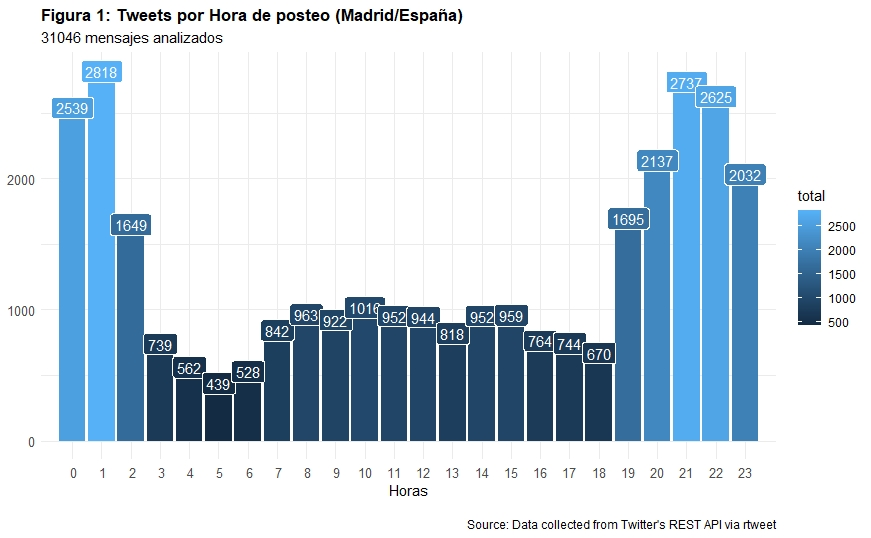
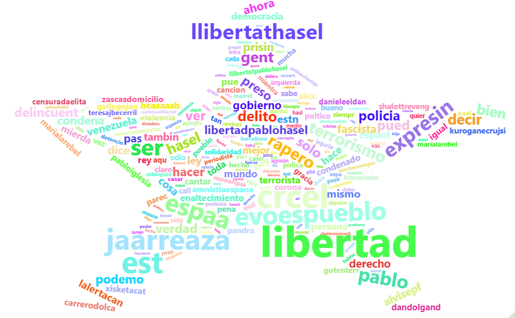
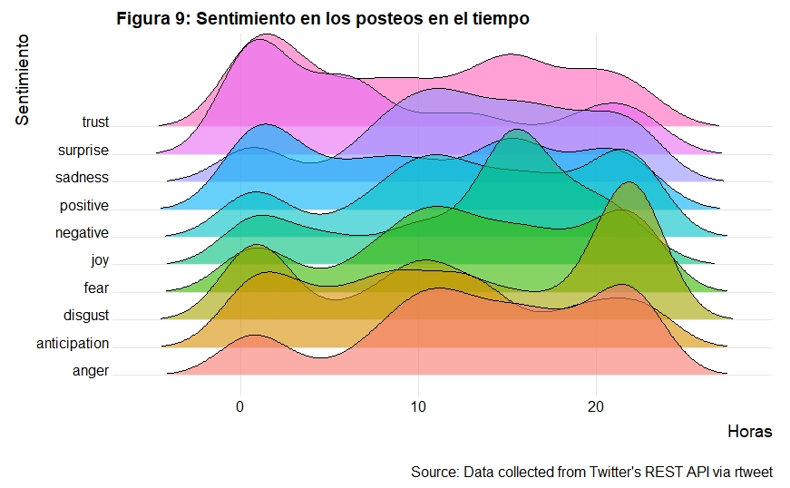
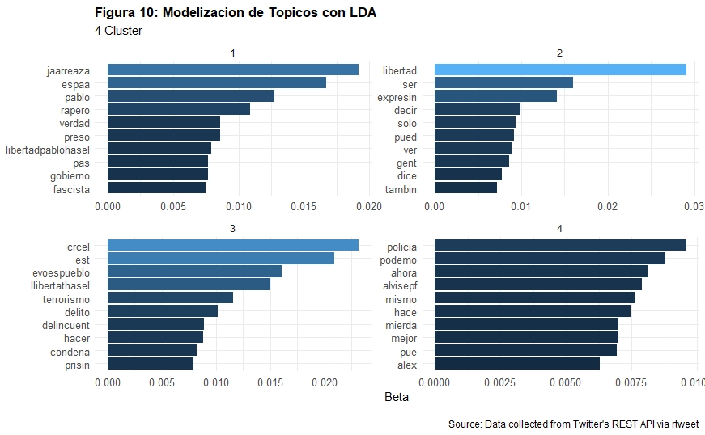

# Minería de Texto con data de Twitter

Ponencia preparada por Linda Cabrera Orellana para el Women in Data Science Ecuador 2021 llevada a cabo el 22 de abril de 2021, organizada por la Sociedad Ecuatoriana de Estadística, iniciativa de la Universidad de Stanford.

## Debate en Twitter sobre el encarcelamiento de PABLO HASÉL

Esta es una introducción al procesamiento de lenguaje natural, conocido por sus siglas en inglés como NLP “Natural language processing”, aplicado al monitoreo de las redes sociales. Para el efecto, se analiza un tema que fue muy controversial en el mes de febrero del 2021, ahora ya suena menos, que es el Encarcelamiento del rapero español Pablo Hasél por injurias a la corona española y terrorismo. Este tema generó una gran cantidad de información en la red social Twitter, proporcionándonos mucho material para el análisis.

### Análisis de datos

Se analizaron los tweets del 17 de febrero de 2021 que corresponden al segundo día de encarcelamiento del rapero Hasél. Se recolectaron los tweets que hacían mención a la cuenta @PabloHasel en el idioma español, dando un total de 31,046 tweets analizados.

### Análisis de sentimientos
El análisis de sentimientos conocido también como opinion mining (minería de opinión) nos ayuda a interpretar actitudes, opiniones y sentimientos de los usuarios, a través de este análisis podremos determinar el tono emocional detrás de las palabras escritas por los usuarios que han mencionado la cuenta @PabloHasel en el segundo día de protestas por el encarcelamiento de Pablo Hasél.

### Asignación Latente de Dirichlet (LDA)

La asignación latente de Dirichlet o LDA (siglas en inglés) es un algoritmo de aprendizaje automático no supervisado que indica que las palabras siguen una hipótesis de bolsa de palabras o, más bien que el orden no importa, que el uso de una palabra es ser parte de un tema y que comunica la misma información sin importar dónde se encuentra en el texto.

Ver blog completo en [Medium](https://medium.com/p/77cf5ddf5273)

